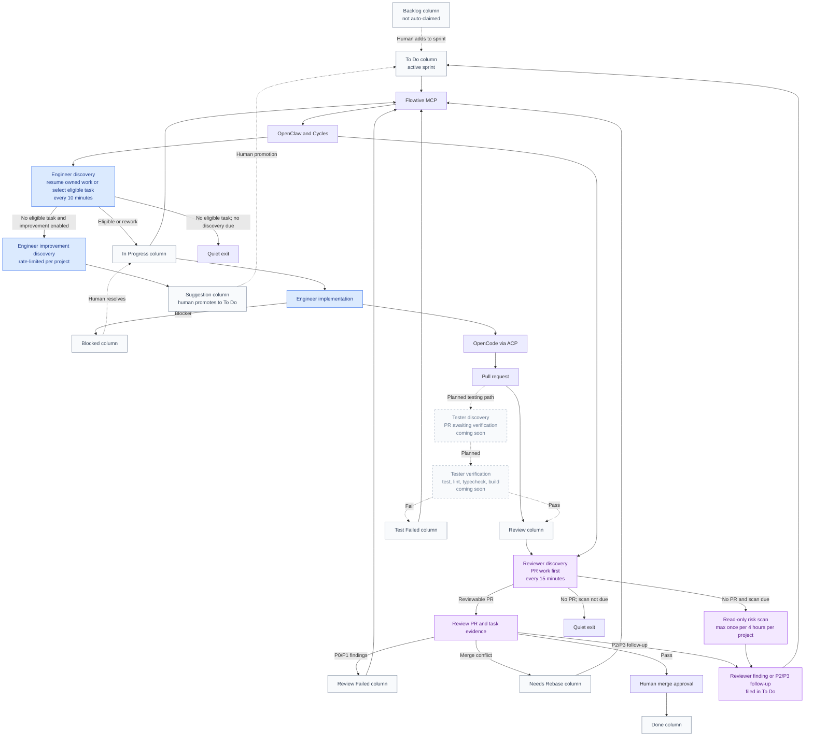

# Firmansyah Otoluwa

## Full-Stack Product Engineer | Agentic AI Systems

I build production web, mobile, and desktop products, plus engineering systems where AI agents implement and review software under human control.

**React** · **React Native** · **Expo** · **Next.js** · **TypeScript** · **Node.js** · **AWS Amplify Gen 2** · **Electron** · **MCP**

Open to remote full-stack, React Native/Expo, product engineering, and AI-agent platform opportunities.

## Selected Work

- **Cycles** (private) - Autonomous engineering orchestration connecting Flowtive, Flowtive MCP, OpenClaw, OpenCode ACP, GitHub pull requests, and human review. An Engineer claims and implements work; an independent Reviewer gates PRs and routes rework back to Flowtive.

- **Flowtive** (private source; public distribution) - Offline-first project management for Kanban, sprints, analytics, LAN sync, and AI-agent collaboration.
  - [VS Code Marketplace](https://marketplace.visualstudio.com/items?itemName=kreaticode.flowtive) · [Open VSX](https://open-vsx.org/extension/kreaticode/flowtive) · [Chrome Web Store](https://chromewebstore.google.com/detail/flowtive-project-manageme/jlakbgpoiloflldfdjmjijafibgadno)
  - [Public releases and privacy policy](https://github.com/programmerlapar/flowtive-releases)

- [**Quidlass**](https://github.com/programmerlapar/quidlass) - Published React and TypeScript liquid-glass component library with zero runtime dependencies, 30+ configurable props, interactive effects, documentation, and a live demo.
  - [npm package](https://www.npmjs.com/package/quidlass) · [Documentation](https://programmerlapar.github.io/quidlass/) · [Live demo](https://programmerlapar.github.io/quidlass/demo/)

- [**Atlas Photo**](https://github.com/programmerlapar/atlas-photo) - Privacy-first Electron photo application with local EXIF/GPS processing, interactive maps, thumbnail caching, and cross-platform releases.
  - [Latest release](https://github.com/programmerlapar/atlas-photo/releases/latest)

- [**openclaw-migrate**](https://github.com/programmerlapar/openclaw-migrate) - Cross-platform TypeScript CLI for safely exporting, inspecting, restoring, and rolling back AI-agent environments.

## Engineering Evidence

- **Shipped products:** public marketplace listings, desktop releases, npm packages, live documentation, and demos
- **Full-stack delivery:** React, React Native/Expo, Next.js, TypeScript, Node.js, authentication, APIs, storage, payments, testing, and deployment
- **Serverless architecture:** AWS Amplify Gen 2, Cognito, DynamoDB, S3, Lambda, and GraphQL
- **AI-agent infrastructure:** MCP integrations, OpenClaw orchestration, ACP coding sessions, PR gates, and human-controlled delivery

View the Cycles architecture

Blue nodes are Engineer paths; purple nodes are Reviewer paths; muted, dashed nodes are the planned Tester path. The Tester role is not active yet.

## Contact

I am available for full-stack product development, React Native/Expo applications, serverless AWS work, and AI-agent engineering systems.
