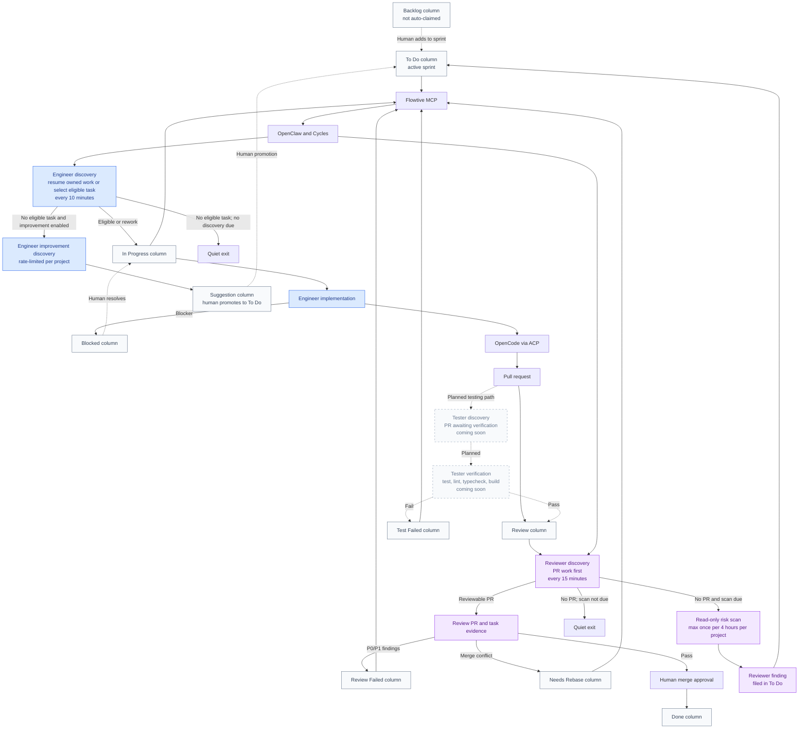

# Firmansyah Otoluwa

## Full-Stack TypeScript Engineer

I build AI-agent workflows, serverless SaaS, and privacy-first desktop products.

**React** · **Next.js** · **TypeScript** · **Node.js** · **AWS Amplify Gen 2** · **Electron** · **MCP**

Open to remote full-stack, product engineering, and AI-agent platform opportunities.

## Featured Work

- [**Flowtive**](https://github.com/programmerlapar/flowtive-app) - Offline-first project management for Kanban, sprints, analytics, LAN sync, and AI-agent collaboration. Available on the web, desktop, Chrome, VS Code, and MCP clients.
- **Cycles** (private) - Human-gated engineering loop.
  Flowtive tasks flow through Flowtive MCP and OpenClaw to an Engineer that runs every 10 minutes and implements through OpenCode ACP. A Reviewer runs every 15 minutes to gate PRs and route rework back to Flowtive.

Blue nodes are Engineer paths; purple nodes are Reviewer paths; muted, dashed nodes
are the planned Tester path. Backlog tasks are intentionally excluded until a human
adds them to an active sprint. The Tester role is not active yet; it will verify
PR-ready branches and record evidence before work proceeds to review or rework.

- [**openclaw-migrate**](https://github.com/programmerlapar/openclaw-migrate) - Cross-platform CLI that safely exports, inspects, restores, and rolls back OpenClaw agent environments.
- [**Atlas Photo**](https://github.com/programmerlapar/atlas-photo) - Privacy-first Electron photo application with local EXIF/GPS processing, interactive maps, thumbnail caching, and cross-platform packaging.

## Product And Platform Experience

- Full-stack product development with React, Next.js, TypeScript, and Node.js
- Serverless architecture with AWS Amplify Gen 2, Cognito, DynamoDB, S3, Lambda, and GraphQL
- AI workflows and developer tooling with Gemini, MCP, and agent orchestration
- Cross-platform desktop applications with Electron, Vite, and local-first data handling
- Product UX with Tailwind CSS, shadcn/ui, Radix UI, and accessible component systems

## Working With Me

I value reliable systems, clear product thinking, and practical automation. My public repositories show the tools and products I actively build.
